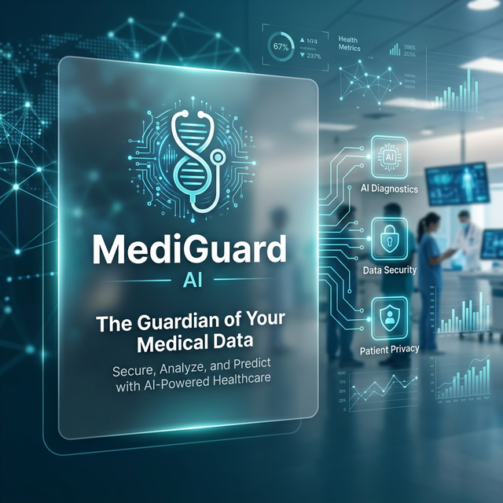

# 🛡️ MediGuard Local CDSS



## 🩺 Professional Clinical Decision Support System (Local-First)

**MediGuard** is a high-performance, privacy-centric medical assistant designed to provide real-time clinical decision support. Built with a local-first philosophy, it ensures that sensitive health data never leaves your machine while providing advanced AI-driven insights, vitals monitoring, and clinical reasoning.

---

## 🚀 Key Features

### 🧠 Advanced Clinical Reasoning
- **SBAR Formatting**: All health summaries and recommendations follow the **Situation, Background, Assessment, Recommendation** professional standard.
- **AI-Powered Diagnostics**: Integrates with local AI models (via Foundry/DirectML) to analyze laboratory reports and patient history.

### 📊 Real-Time Vitals Monitoring
- **Automatic Flagging**: Instant detection of clinical abnormalities based on established medical thresholds:
  - **Hypertension**: Detection of Stage 2 levels (>140/90 mmHg).
  - **Diabetes/Prediabetes**: Glucose level classification (Normal, Prediabetic, Diabetic).
  - **BMI Analysis**: Automatic calculation and classification (Overweight, Obese).

### 🥗 Dietary Correlation Engine
- **Nutritional Guidance**: Context-aware recommendations based on clinical findings (e.g., purine-rich food avoidance for high uric acid, sodium reduction for hypertension).
- **Activity Protocols**: Suggests evidence-based physical activity goals (e.g., 150 min/week aerobic activity).

### 🔒 Privacy & Security (HIPAA Ready)
- **Local AI Processing**: Compute happens on your hardware; no cloud dependency for PHI analysis.
- **In-Memory Logic**: Designed to minimize disk persistence of sensitive data.

---

## 🛠️ Tech Stack

- **Framework**: [React 19](https://react.dev/)
- **Build Tool**: [Vite 7](https://vitejs.dev/)
- **Styling**: [Tailwind CSS v4](https://tailwindcss.com/)
- **State Management**: [Zustand](https://github.com/pmndrs/zustand)
- **Animations**: [Framer Motion](https://www.framer.com/motion/)
- **Icons**: [Lucide React](https://lucide.dev/)
- **Backend API**: Axios for local endpoint communication.

---

## 📂 Project Structure

```bash
├── src/
│   ├── components/      # UI Components (Dashboard, Chat, etc.)
│   ├── services/        # AI and Data processing logic
│   ├── store/           # Zustand state management
│   ├── styles/          # Global CSS and Tailwind configurations
│   └── App.jsx          # Root application component
├── public/              # Static assets and banners
└── skills.md            # Clinical knowledge base & protocols
```

---

## 🏃 Getting Started

### Prerequisites
- [Node.js](https://nodejs.org/) (v18+)
- [npm](https://www.npmjs.com/) or [yarn](https://yarnpkg.com/)

### Installation

1. **Clone the repository**:
   ```bash
   git clone https://github.com/Harshtech1/mediguard-local-cdss.git
   cd mediguard-local-cdss
   ```

2. **Install dependencies**:
   ```bash
   npm install
   ```

3. **Start the development server**:
   ```bash
   npm run dev
   ```

---

## ⚖️ Disclaimer

> [!WARNING]
> **MediGuard is a Clinical Decision Support System (CDSS) prototype.** It is intended for informational/educational purposes and to assist clinicians. It is NOT a substitute for professional medical diagnosis, treatment, or advice. Always consult a qualified human healthcare provider for clinical decisions.

---

## 📄 License

This project is specialized for local clinical environments. See the LICENSE file for details.

---

<p align="center">
  Built with ❤️ for Healthcare Innovation by <b>Harshtech1</b>
</p>
